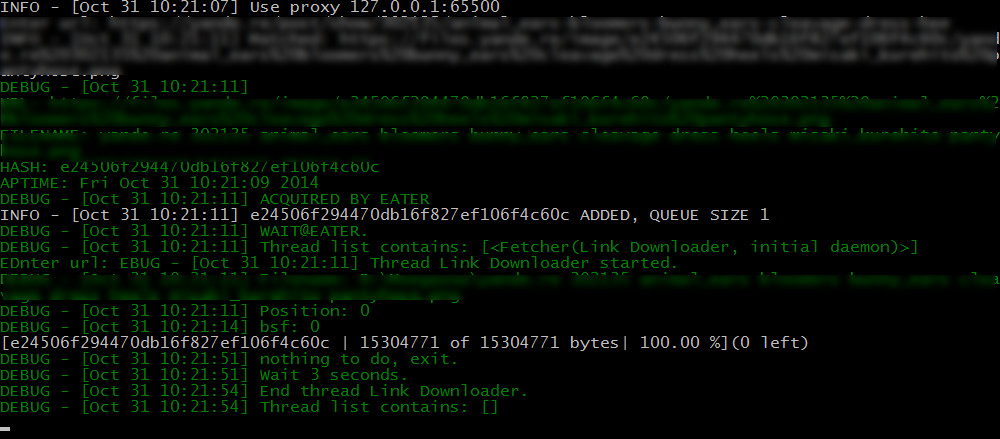
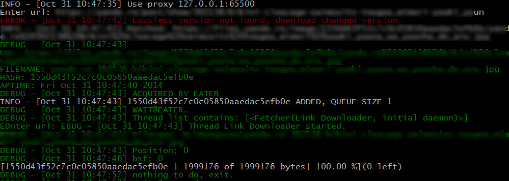

说明
============
这个脚本可以用来下载类似萌妹或者konachan之类网站上的图片内容，默认下载无损图片。

特性
============
* 支持断点续传
* 使用sqlite数据库记录下载过的文件信息
* 支持socks代理（需要在配置文件中配置）

截图
============

需求
===========
* Python 2.7
* socks (请执行 `pip install socksipy` 进行安装)
* beautifulsoup4

使用方法
============
直接执行此脚本，可以直接复制链接或者在post页面上的预览图片上单击右键->复制链接地址然后粘贴，程序会自动处理这些链接已获得正确的下载地址然后执行下载任务。

补充说明
===========
因为网速过慢，这个脚本模式使用了代理，我只用了ss，别的https代理的话除了goagent之外应该都能用，可能需要在配置文件中改一下。另外测试的话我只在Windows下使用过这个脚本，其他的linux发行版应该也可以。

已知问题
===========
* 为了减轻网站的负载，下载线程数目被我限制在了1个，目前没有更改的意思。
* 某些情况下解析出的地址不会触发下载，原因目前正在分析中。
